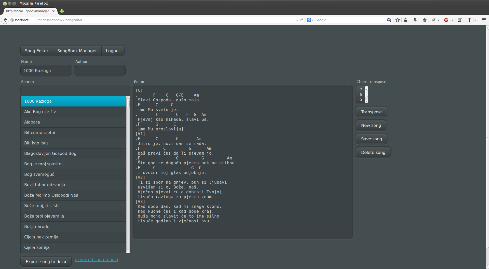
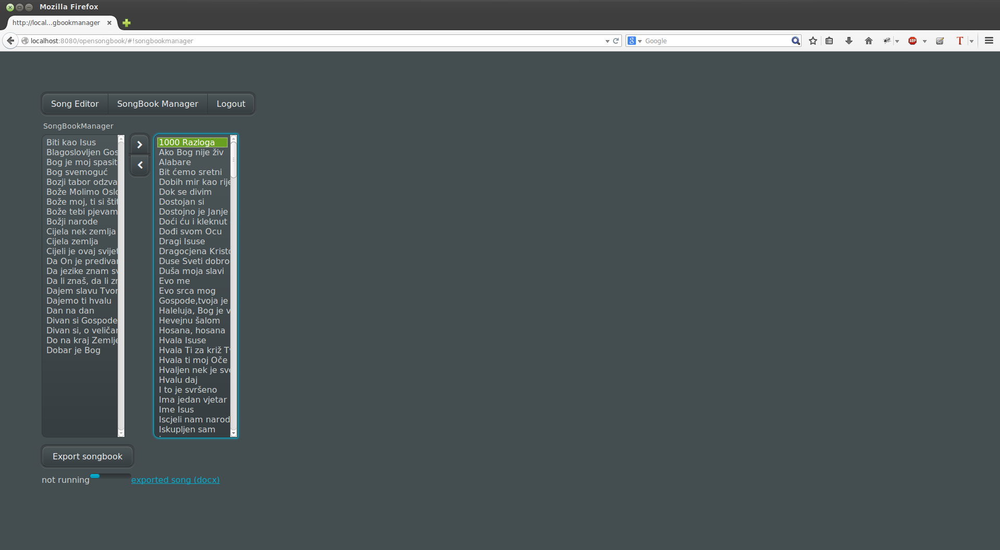
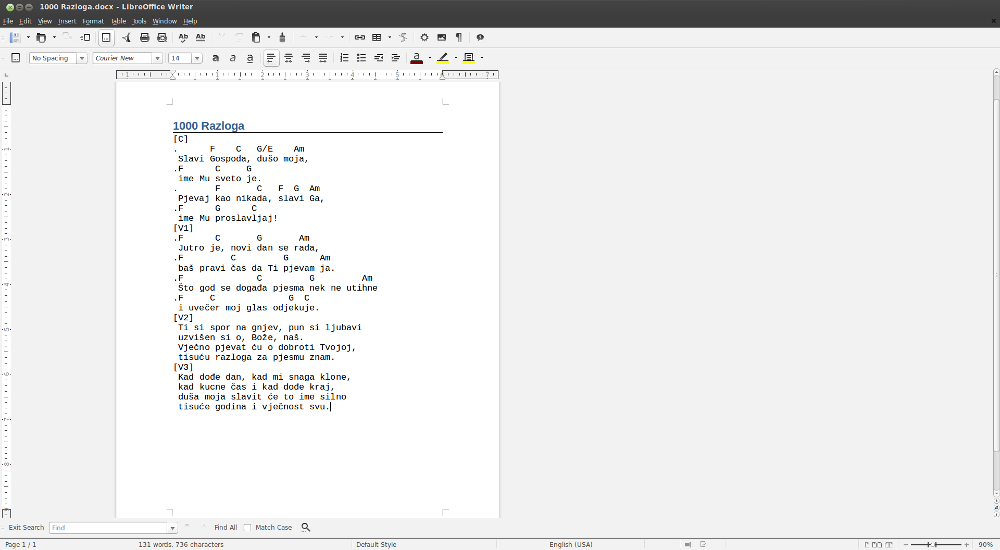
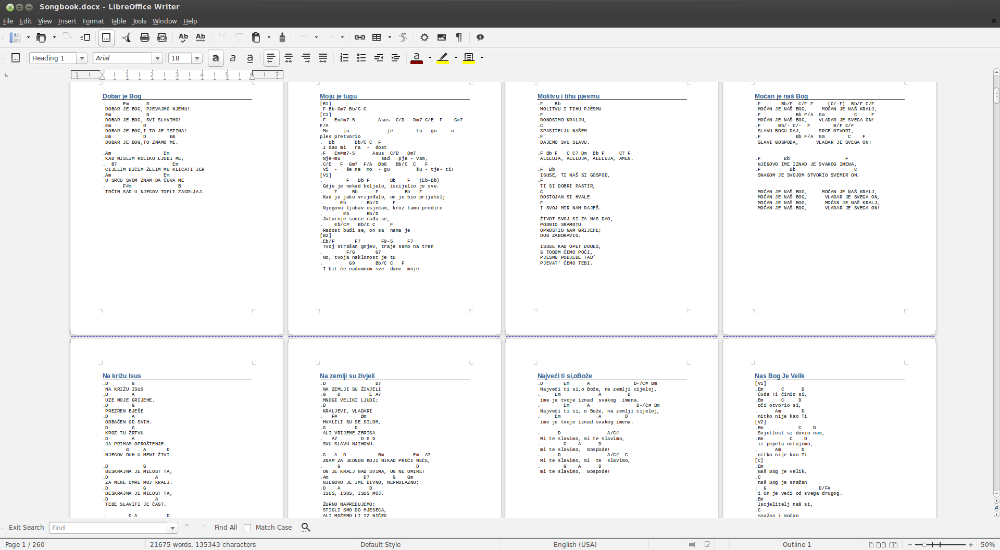

# OpenSongbook
===============

## Introduction
------------

**OpenSongbook** is a simple open source song/songbook (with chords) manager web service.
It has simple straightforward user interface and functionality that I've found lacking
in other song management software - e.g. [OpenSong](http://www.opensong.org/) 
(it is only local desktop application, no database sync, revisioning, 
bad multi-platform support, isn't easily customizable, no export to editable formats, 
no songbook management...). 

OpenSongbook main advantage is chord manipulation and centralized database that could be 
used for collaboration of multiple users which could add new songs to database.

Please have in mind that this whole project is still under heavy development and has lots 
of bugs, discrepancies and possible/mandatory improvements. So I will continue to work on 
it as time allows me.

## Features:
* Chord manipulation - chord transposition
* SCRUD functionality - search through song lyrics, read/add/delete/update songs
* Song export 2 docx functionality - export single song or export selection of songs
to create consistent and formatted songbook with numeration and song content

## Planned features:
* Import from other song format (currently opensongbook format works quick & dirty way)
* Export songs to [OpenLP](http://openlp.org/) projection software
* Public and private songbooks
* Song revisions
* User management
* Integration tests
* Many other goodies... :)

OpenSongbook has small footprint and completely embedded functionality - no external
database needed. Everything is wrapped inside servlet and can be easily deployed in 
any Servlet 3.0 compliant servlet container (tested on Tomcat7 and Tomcat8). 
For song database [HSQLDB](http://hsqldb.org/) database is used. 
Web service is built on [Vaadin framework](https://www.vaadin.com)

### Used stack
#### Development
* [Java 7](https://www.java.com/)
* [Vaadin](https://www.vaadin.com) 
* [Eclipse](https://eclipse.org/) 
* [logback](http://logback.qos.ch/)

#### Testing
* [testNG](http://testng.org/)
* [seleniumhq](http://www.seleniumhq.org/)

#### CI
* [ant](http://ant.apache.org/) 
* [jenkins-ci](http://jenkins-ci.org/)

License
-------

OpenSongbook is open source software provided under under [Apache License 2.0](http://apache.org/licenses/LICENSE-2.0)